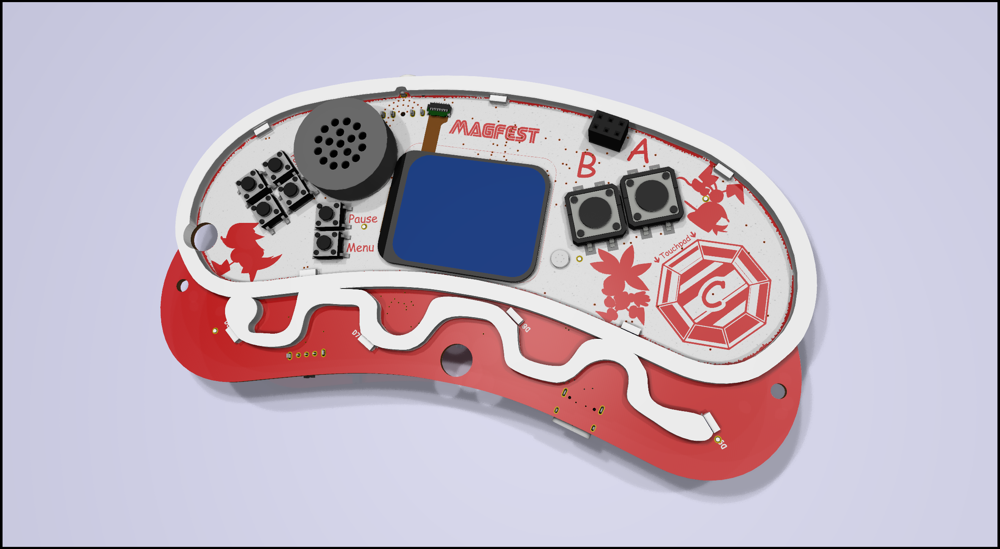

# Super Magfest 2025 Swadge Hardware

## Welcome

This is the hardware repository for the Super Magfest 2025 Swadge.

The corresponding firmware repository for the Super Magfest 2025 Swadge [can be found here](https://github.com/AEFeinstein/Swadge-IDF-5.0).

If you have any questions, feel free to create a Github ticket or email us at circuitboards@magfest.org.

## Render

## Schematic

## Directories

### `art`
This directory has the SVGs used to generate the KiCad files. The SVGs are drawn in [Inkscape](https://inkscape.org/).

### `Swadge-Parts`
This directory is a git submodule which has all the parts, footprints, and 3D models used in the KiCad project.

### `Swadge-HW`
This directory has the KiCad project for the main Swadge PCB.

### `Swadge-HW/3d-Print`
This directory has the 3D print files for the 2025 Swadge, including the shells and D-pad.
