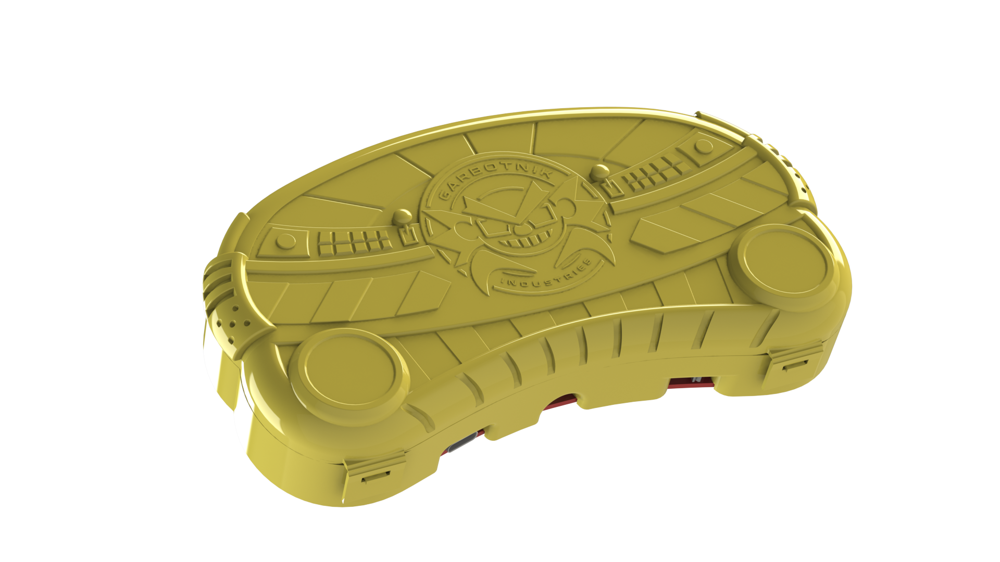

<!--
*** Thanks for checking out the Best-README-Template. If you have a suggestion
*** that would make this better, please fork the repo and create a pull request
*** or simply open an issue with the tag "enhancement".
*** Don't forget to give the project a star!
*** Thanks again! Now go create something AMAZING! :D
-->

<!-- PROJECT SHIELDS -->
<!--
*** I'm using markdown "reference style" links for readability.
*** Reference links are enclosed in brackets [ ] instead of parentheses ( ).
*** See the bottom of this document for the declaration of the reference variables
*** for contributors-url, forks-url, etc. This is an optional, concise syntax you may use.
*** https://www.markdownguide.org/basic-syntax/#reference-style-links
-->

<!-- PROJECT LOGO -->
 
   
  <h1 align="center">Super 2025 SwadgeDog Shell</h1>

  

    Carry-out Ready

### Built With
 

* [Fusion 360]( https://www.autodesk.com/products/fusion-360/overview?term=1-YEAR&tab=subscription) 
* [SOLIDWORKS 2023](https://www.solidworks.com) 
* [Blender](https://www.blender.org) 

(<a href="#top">back to top</a>)

<!-- GETTING STARTED -->
## Getting Started
 
The Hot Dog Shell 3D design team comprised of Erik Jacobs, Greg Lord, and Emily Anthony created two shell variants for Super 2025:

* A simplified model optimized for printing, open for customization and creative usage of infill for FDM printers
* A case with a living hinge, designed for injection molding out of PP

Injection Molded shells are only available at the Fangamer Merch Booth at Super 2025.

To print your own simple model:
 
Identify which type of printing technology you’d like to use to replicate your Shell. It’s sincerely not recommended to use the Injection Molding files for FDM printers, though you can try. It's likely the hinge will break.
 

### Materials

Materials required vary based on your printing method. It is recommended to print the FDM Shell with PETG or TPU, but really you can use any filament on hand.

### Assembly

FDM Fasteners:

Any M3 x 6mm self tapping screw

<!-- CONTRIBUTING -->
## Contributing

Contributions are what make the open-source community such an amazing place to learn, inspire, and create. Any contributions you make are **greatly appreciated**.

If you have a suggestion that would make this better, please fork the repo and create a pull request. You can also simply open an issue with the tag "enhancement".
Don't forget to give the project a star! Thanks again!

1. Fork the Project
2. Create your Feature Branch (`git checkout -b feature/AmazingFeature`)
3. Commit your Changes (`git commit -m 'Add some AmazingFeature'`)
4. Push to the Branch (`git push origin feature/AmazingFeature`)
5. Open a Pull Request

(<a href="#top">back to top</a>)

<!-- LICENSE -->
## License

<a property="dct:title" rel="cc:attributionURL" href="https://github.com/AEFeinstein/Super-2025-Swadge-HW/tree/main/Swadge-HW/3D-Print">Swadge Shell</a> by <a rel="cc:attributionURL dct:creator" property="cc:attributionName" href="https://github.com/emilyanthony4244">Emily Anthony</a> is licensed under <a href="http://creativecommons.org/licenses/by-nc-sa/4.0/?ref=chooser-v1" target="_blank" rel="license noopener noreferrer" style="display:inline-block;">CC BY-NC-SA 4.0</a>

<!-- CONTACT -->
## Contact

Emily Anthony - [@thelegendofemily](https://www.thelegendofemily.com) 

Greg Lord –
[@gplord]( https://www.gplord.com/)

Erik Jacobs 

Project Link: https://github.com/AEFeinstein/Super-2025-Swadge-HW/

(<a href="#top">back to top</a>)

<!-- ACKNOWLEDGMENTS -->
## Acknowledgments

* The Swadge team for idea generation, continuous feedback, and excellent vibes
* MAGFest volunteers and employees for their overwhelming support and willingness to help push this side project
* [OthNealDrew’s Readme template]( https://github.com/othneildrew/Best-README-Template)

(<a href="#top">back to top</a>)

<!-- MARKDOWN LINKS & IMAGES -->
<!-- https://www.markdownguide.org/basic-syntax/#reference-style-links -->
[contributors-shield]: https://img.shields.io/github/contributors/emilyanthony4244/Sheikah_Slate.svg?style=for-the-badge
[contributors-url]: 
https://github.com/AEFeinstein/Super-2025-Swadge-HW/graphs/contributors

